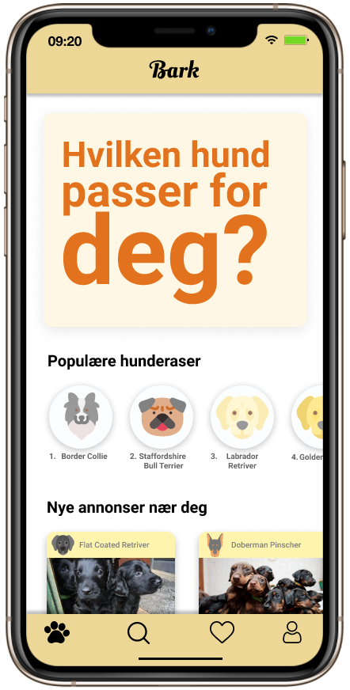
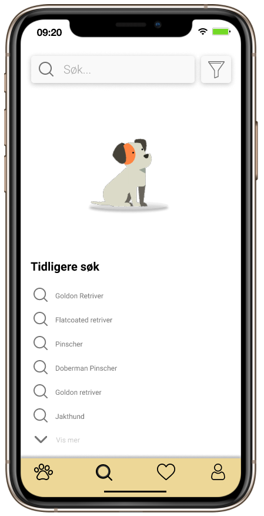
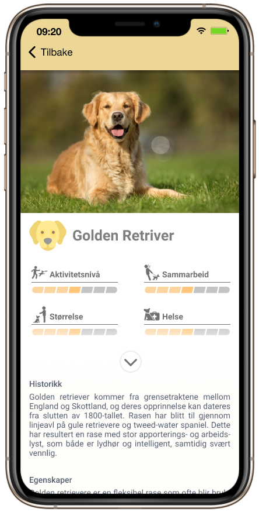
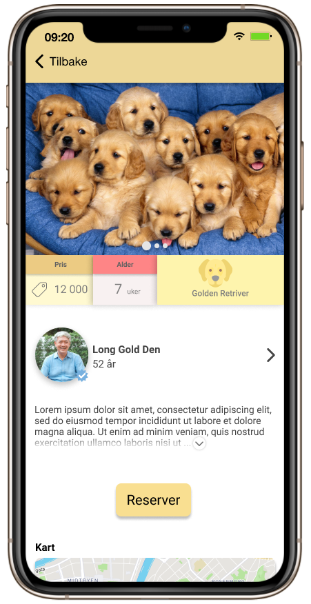

# Bark 🐶
## What is Bark? 🤔
Bark is a meeting place for breeders, dog owners and people that want to learn more abaout dog breeds and potentially getting or adopting a dog. Bark is focused on giving dog owners the best information about dog breeds and user experience in the process of adding one hairy friend into their family. Being able to find dog breeds that suit their living habits is important, and Bark is therefor focused on helping people to make the right choice. With the focus on bringing the best information together with an easy and fun user experience, Bark has a goal of becoming the "go to place" for people that are looking for a dog. Bark is first and foremost exclusively intended for dogs, but have a long term goal to include other domestic animals such as cats and horses.
## Application 🚀
The Bark application is designed in [figma](https://www.figma.com/proto/tMuY4Iib45vr69MZ21U5Zi/Bark?page-id=0%3A1&node-id=7%3A4&viewport=241%2C48%2C0.27&scaling=scale-down&starting-point-node-id=7%3A4&show-proto-sidebar=1)
and is developed for iOS and Android using React Native with Typescript. It is still in development stages, although the design is close to finished.


## Running development project
From rootfolder:
Run:
```
npm install
```
Then:
```
npm start


